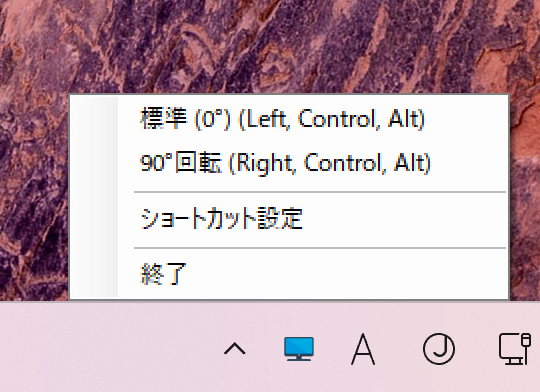

# DisplayRotator

[English Version](README_EN.md)

DisplayRotator は、ディスプレイの回転を簡単に管理するためのツールです。ショートカットキーを設定して、ディスプレイの回転を素早く切り替えることができます。



## 特徴

- ディスプレイの回転を簡単に管理
- ショートカットキーの設定と削除
- 回転設定の有効/無効の切り替え
- 通知アイコンからの簡単な操作

## インストール

### 方法 1: バイナリのダウンロード

1. [リリースページ](https://github.com/nirvash/DisplayRotator/releases)から最新のバイナリをダウンロードします。
2. ダウンロードした zip ファイルを解凍します。
3. `DisplayRotator.exe`を実行します。

### 方法 2: ソースからビルド

1. リポジトリをクローンします。

   ```bash
   git clone https://github.com/nirvash/DisplayRotator.git
   ```

2. プロジェクトをビルドします。

   ```bash
   cd DisplayRotator
   dotnet build
   ```

3. アプリケーションを実行します。

   ```bash
   dotnet run
   ```

## 使用方法

1. アプリケーションを起動すると、通知領域にアイコンが表示されます。
2. アイコンを右クリックして、コンテキストメニューを表示します。
3. メニューから回転方向を選択して、ディスプレイを回転させます。
4. 「ショートカット設定」を選択して、ショートカットキーを設定します。

## ショートカットキーの設定

1. 「ショートカット設定」ウィンドウを開きます。
2. 各回転方向に対してショートカットキーを設定します。
3. 設定を保存してウィンドウを閉じます。

## 開発

### 必要なツール

- .NET SDK

### コントリビュート

1. リポジトリをフォークします。
2. 新しいブランチを作成します。

   ```bash
   git checkout -b feature/your-feature
   ```

3. 変更をコミットします。

   ```bash
   git commit -m 'Add some feature'
   ```

4. ブランチにプッシュします。

   ```bash
   git push origin feature/your-feature
   ```

5. プルリクエストを作成します。

## プロジェクト構成

```
DisplayRotator/
├── .github/                 # GitHub関連の設定
│   └── workflows/          # GitHub Actionsワークフロー
│       └── release.yml     # リリースビルド設定
├── assets/                 # リソースファイル
│   └── display.ico        # アプリケーションアイコン
├── src/                    # ソースコード
│   ├── DisplayRotator.csproj
│   ├── MainForm.cs        # メインフォーム
│   ├── Program.cs         # エントリーポイント
│   ├── RotationConstants.cs
│   ├── SettingsManager.cs
│   ├── ShortcutForm.cs
│   └── ShortcutSettingsForm.cs
├── .gitignore
├── DisplayRotator.sln      # ソリューションファイル
├── LICENSE                 # MITライセンス
├── README.md              # 日本語ドキュメント
└── README_EN.md           # 英語ドキュメント
```

## ライセンス

このプロジェクトは MIT ライセンスの下でライセンスされています。詳細については、[LICENSE](LICENSE)ファイルを参照してください。

## 開発者向けドキュメント

詳細な開発者向けドキュメントについては、[Developer Guide](Developer.md) を参照してください。
