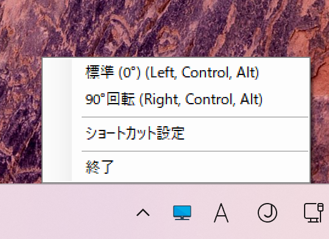

# DisplayRotator

[日本語版](README.md)

DisplayRotator is a tool for easily managing display rotation. You can set shortcut keys to quickly switch display rotation.



## Features

- Easily manage display rotation
- Set and remove shortcut keys
- Enable/disable rotation settings
- Easy operation from the notification icon

## Installation

### Option 1: Download Binary

1. Download the latest binary from the [releases page](https://github.com/nirvash/DisplayRotator/releases).
2. Extract the downloaded zip file.
3. Run `DisplayRotator.exe`.

### Option 2: Build from Source

1. Clone the repository.

   ```bash
   git clone https://github.com/nirvash/DisplayRotator.git
   ```

2. Build the project.

   ```bash
   cd DisplayRotator
   dotnet build
   ```

3. Run the application.

   ```bash
   dotnet run
   ```

## Usage

1. When you start the application, an icon will appear in the notification area.
2. Right-click the icon to display the context menu.
3. Select the rotation direction from the menu to rotate the display.
4. Select "Shortcut Settings" to set shortcut keys.

## Setting Shortcut Keys

1. Open the "Shortcut Settings" window.
2. Set shortcut keys for each rotation direction.
3. Save the settings and close the window.

## Development

### Required Tools

- .NET SDK

### Contributing

1. Fork the repository.
2. Create a new branch.

   ```bash
   git checkout -b feature/your-feature
   ```

3. Commit your changes.

   ```bash
   git commit -m 'Add some feature'
   ```

4. Push to the branch.

   ```bash
   git push origin feature/your-feature
   ```

5. Create a pull request.

## Project Structure

```
DisplayRotator/
├── .github/                 # GitHub related settings
│   └── workflows/          # GitHub Actions workflows
│       └── release.yml     # Release build configuration
├── assets/                 # Resource files
│   └── display.ico        # Application icon
├── src/                    # Source code
│   ├── DisplayRotator.csproj
│   ├── MainForm.cs        # Main form
│   ├── Program.cs         # Entry point
│   ├── RotationConstants.cs
│   ├── SettingsManager.cs
│   ├── ShortcutForm.cs
│   └── ShortcutSettingsForm.cs
├── .gitignore
├── DisplayRotator.sln      # Solution file
├── LICENSE                 # MIT License
├── README.md              # Japanese documentation
└── README_EN.md           # English documentation
```

## License

This project is licensed under the MIT License. See the [LICENSE](LICENSE) file for details.

## Developer Documentation

For detailed developer documentation, see the [Developer Guide](Developer.md).
